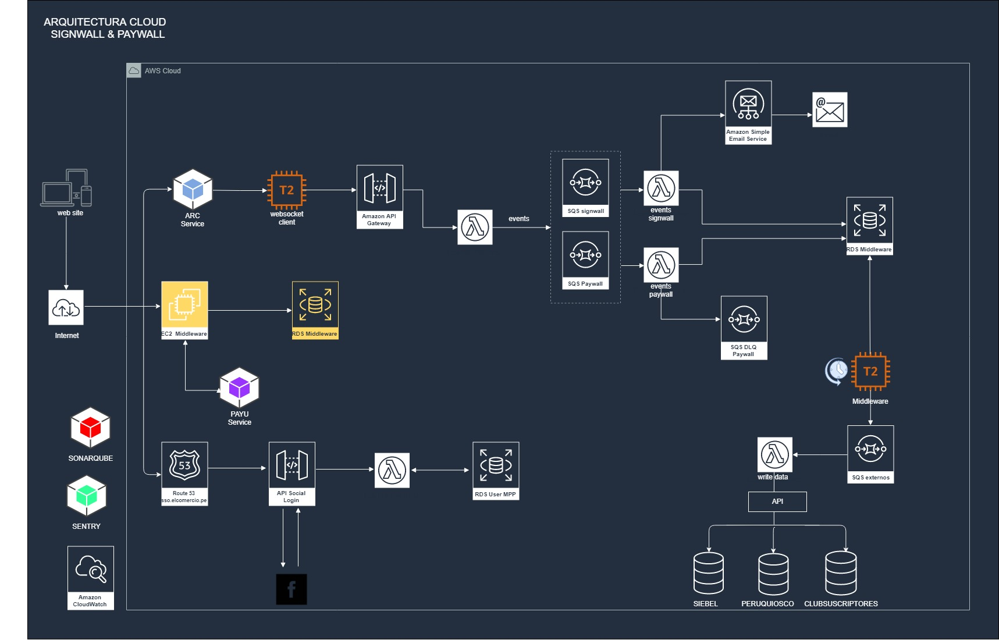

# Paywall • Middleware

## Requerimientos

* Python 3.7.3
* Base de datos PostgreSQL 10 o superior.

## Dependencias
* Para el módulo lxml:

    ```
    # Debian / Ubuntu
    $ sudo apt-get install libxml2-dev libxslt-dev
    ```
* Para el módulo mysqlclient:

    ```
    # Debian / Ubuntu
    $ sudo apt-get install python-dev libmysqlclient-dev

    # Red Hat / CentOS
    $ sudo yum install python-devel mysql-devel
    ```

## Instalación
1. Crear una copia del archivo de configuración local_settings.dist.py:


    ```
    $ cp [PROJECT_DIR]/src/project/settings/local_settings.dist.py \
    [PROJECT_DIR]/src/project/settings/local_settings.py
    ```

2. En local_settings.py, configurar los parámetros con los valores que correspondan (TEST o PRO).
3. Acopiar estáticos:

    ```
    $ python manage.py collectstatic
    ```

4. Servir los archivos de stc/static_files/ en la ruta asignada en STATIC_URL.

## Arquitectura


